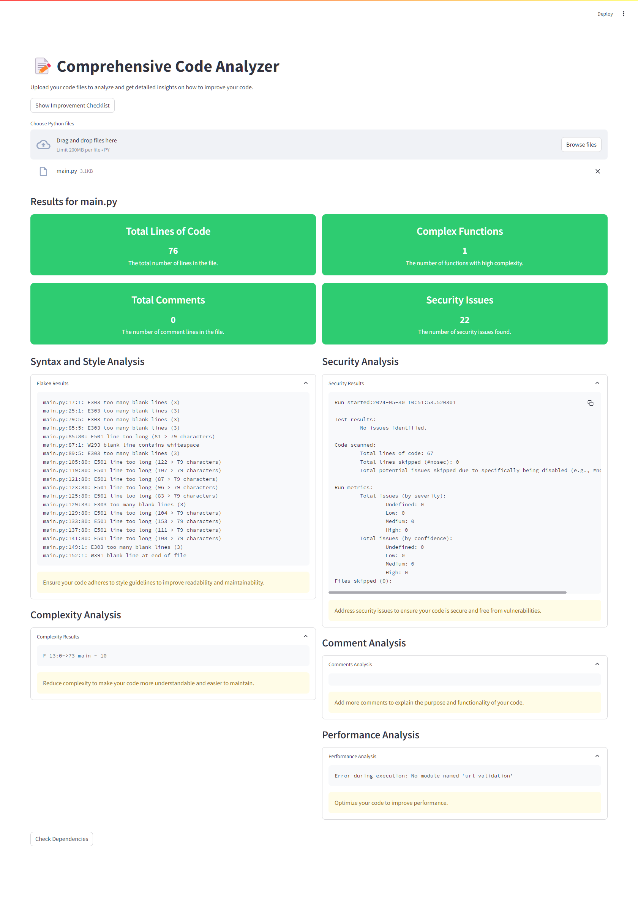

# Comprehensive Python Code Analyzer 

📝 Comprehensive Code Analyzer is a Streamlit application that allows you to analyze Python code files for style, complexity, security, and performance. It provides detailed insights and actionable advice to improve your code quality.

## Features

- **Syntax and Style Analysis:** Ensures code adheres to style guidelines.
- **Complexity Analysis:** Identifies complex functions for better maintainability.
- **Security Analysis:** Detects security vulnerabilities in the code.
- **Comment Analysis:** Analyzes and provides feedback on code comments.
- **Performance Analysis:** Measures and optimizes code performance.
- **Dependency Analysis:** Checks for vulnerabilities in project dependencies.
- **Improvement Checklist:** Provides a checklist of improvements for code quality.

## Screenshots

### Home Page


## Installation

1. Clone the repository:
    ```sh
    git clone https://github.com/Ismail-Mouyahada/Master-python-check-code-app.git
    cd Master-python-check-code-app
    ```

2. Create and activate a virtual environment:
    ```sh
    python -m venv venv
    source venv/bin/activate  # On Windows use `venv\Scripts\activate`
    ```

3. Install the required packages:
    ```sh
    pip install -r requirements.txt
    ```

4. Install the necessary code analysis tools:
    ```sh
    pip install flake8 bandit safety radon
    ```

## Usage

1. Run the Streamlit application:
    ```sh
    streamlit run code-checker.py
    ```

2. Upload your Python code files to analyze and get detailed insights on how to improve your code.

## Contributing

Contributions are welcome! Please open an issue or submit a pull request.

## License

This project is licensed under the MIT License.

---

Created by Ismail Mouyahada